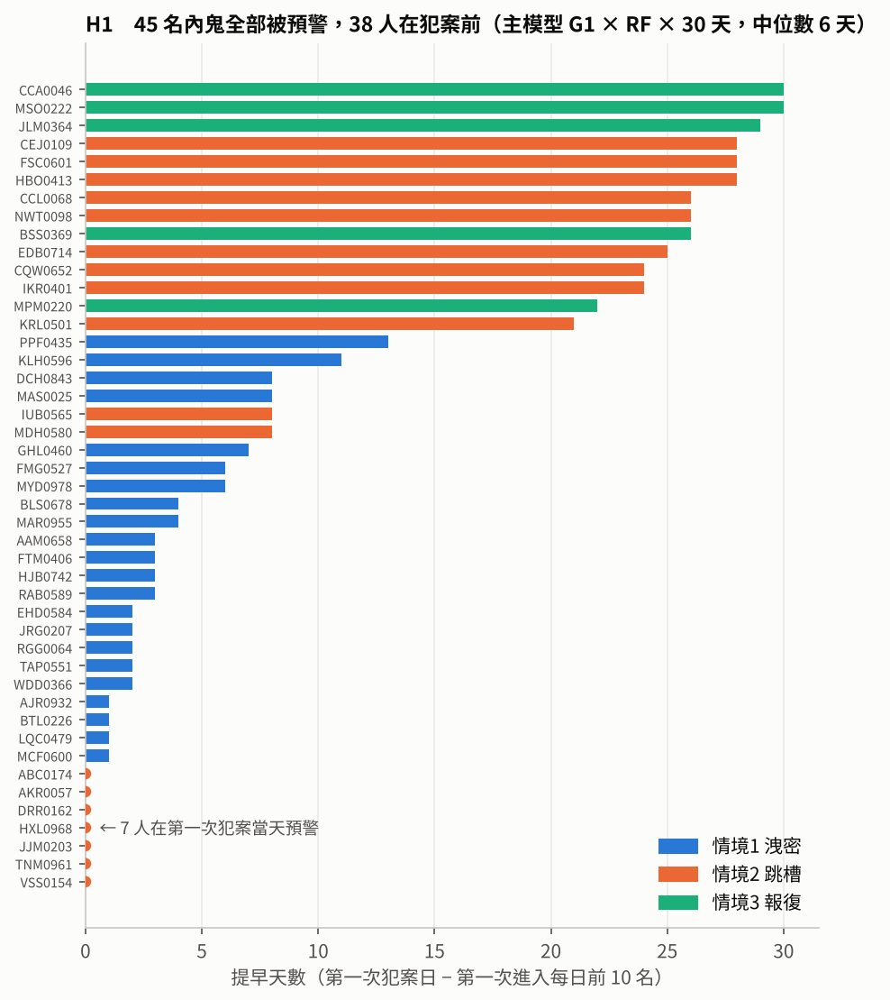
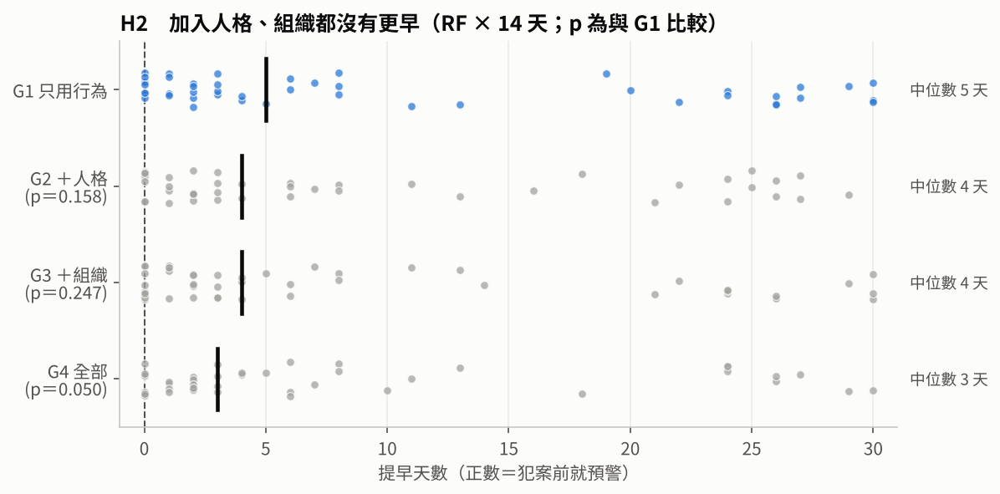
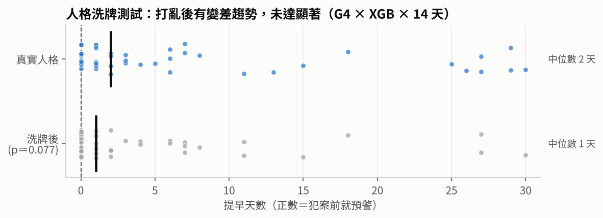
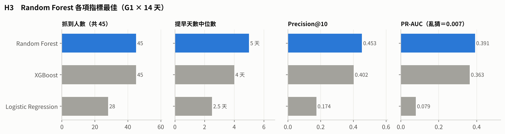
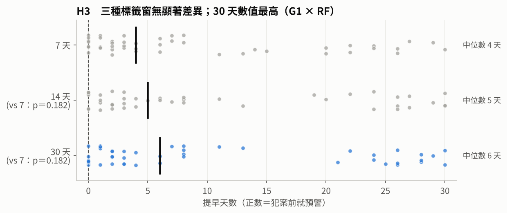
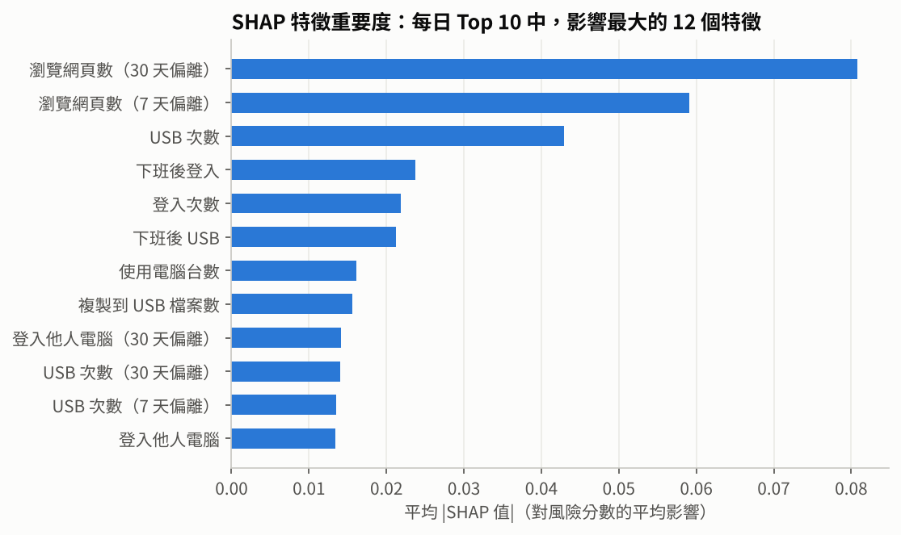
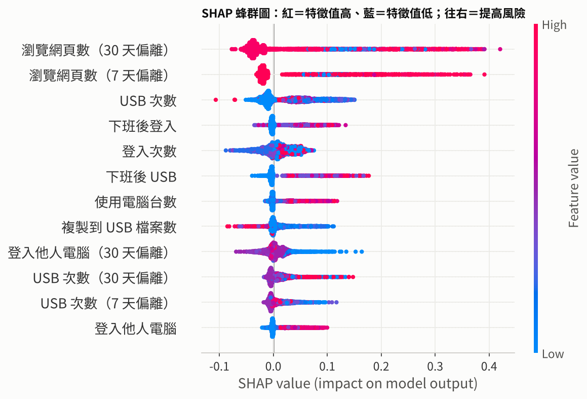
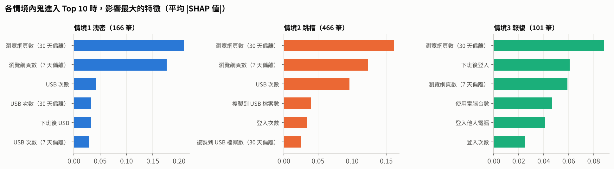

# 第二部分方法細節（Machine Learning）

> 本文件記錄第二部分的資料、特徵、實驗設計與各步驟結果。整體架構與研究方向見 [MLreadme.md](MLreadme.md)。

## 研究假設（驗證結果見 5.）

> | # | 假設 | 驗證方式 |
> |---|---|---|
> | **H1** | 以「人 × 天」＋「與自身過去比」，能在**第一次犯案前**就發出預警 | 提早天數 > 0 的人數 |
> | **H2** | 加入 OCEAN＋LDAP（含人格 × 狀態交互項），能比**只用行為**更早預警 | 4 組特徵比較、人格洗牌測試 |
> | **H3** | 不同模型（Logistic Regression／Random Forest／XGBoost）與標籤窗（7／14／30 天）會影響提前預警的效果 | 3 種模型、3 種標籤窗比較 |
>
> 前提：不追求精確率、召回率的高分，每天只調查前 10 名，在此限制下比「提早幾天」。

## 驗證方式（細節見 4.）

> | 項目 | 做法 |
> |---|---|
> | **資料切分** | **模擬公司真的上線，每個月都用最新的資料重新訓練**：2010/8/1 以前只當訓練資料；之後逐月滾動，每月用「該月以前」的全部資料訓練，再替該月每一天排出風險前 10 名 |
> | **量尺** | 對每個內鬼，從「**第一次犯案前 30 天**」起，找他**第一次進入每日前 10 名**的日子；提早天數 ＝ 第一次犯案日 − 第一次預警日。三種標籤窗都用這把尺 |
> | **方法** | 比較 特徵組（行為／＋人格／＋組織／全部）× 模型（Logistic Regression／Random Forest／XGBoost）× 標籤窗（7／14／30 天），看哪一組**提早天數最多** |

---

---

## 已知資料現況

- 每人每日特徵表：33 萬筆、1,000 人，其中 **70 人**為惡意人員（含 OCEAN、部門、職稱、主管欄位）
- 資料期間：2010/01/02～2011/05/17
- 惡意人員第一次犯案前，最少有 111 天、中位數 192 天的正常紀錄
- 第一次犯案時間分散於 2010/06～2011/04

**資料集設定的三種內鬼情境**（CERT r4.2 內建劇本）

| 情境 | 劇本 | 人數 |
|---|---|---|
| 1 洩密 | 平常不用 USB、不加班的人，開始下班後登入、插 USB，把資料上傳到 wikileaks，之後離職 | 30 |
| 2 跳槽 | 開始瀏覽求職網站、向競爭對手求職，離職前用 USB 大量帶走資料 | 30 |
| 3 報復 | 心生不滿的系統管理員，下載鍵盤側錄程式、用 USB 裝到主管電腦，盜用主管帳號寄出大量恐慌信，之後離職 | 10 |

## 資料粒度

**一列＝人 × 天**（約 33 萬列）。較長時間的資訊（過去 30 天基準、LDAP 月快照、OCEAN）以「貼上去」的方式放進每一列。原因：要每天排出 Top10，每個人每天都要有一個分數。

## 特徵分層

| 層 | 內容 | 時間長度 |
|---|---|---|
| A 今日行為 | 步驟 1. 的 23 個欄位＋是否週末 | 1 天 |
| B 自身偏離 | （今日 − 過去平均）／（過去標準差 + 1），視窗不含當天 | 過去 7／30 天 |
| C 組織事件 | 全公司／同部門／同團隊上月離開人數、部門近 3 月累計離開 | 月（只用上月以前快照） |
| D 人格 | OCEAN | 固定 |
| E 交互項 | N × 周遭離職、C × 上下班偏離、A × 外部收件偏離 | — |

> 不做的特徵：「主管更換／主管已離職」r4.2 期間內恆為 0；「本人距離職天數」要知道未來才算得出來（見 2.）。

## 比較組

| 組 | 特徵 | 要回答的問題 |
|---|---|---|
| G1 | A＋B | 嚴格考法下，只靠行為能抓到多少 |
| G2 | A＋B＋D | 加人格有沒有比較早（跟 G1 比） |
| G3 | A＋B＋C | 加組織變動有沒有比較早（跟 G1 比） |
| G4 | A＋B＋C＋D＋E | 再加人格 × 組織變動，有沒有更早（跟 G3 比） |

原規劃每組另跑「不含本人離職特徵」版，改為**完全不使用**該特徵：它需要未來資訊，且情境 1、2、3 劇本都寫明「之後離職」，放進去等於洩漏答案（見 2.）。

## 執行步驟

```
⓪ 看標籤分布 → ① 原始 CSV → 人×天 → ② 特徵 → ③ 標籤 → ④ 訓練與評估 → ⑤ 解釋＋匯出給 Power BI
```

| 步驟 | 內容 | 程式 |
|---|---|---|
| ⓪ 標籤探索 | 讀 `insiders.csv`（dataset = 4.2），看各情境人數、犯案期長度、每月首次犯案人數，決定切分方式 | `00_explore_labels.py` |
| ① 每日彙總 | DuckDB 直接讀全期間原始 CSV（第一部分 SQL 僅涵蓋 2010/7/20～8/20，邏輯沿用），各來源輸出 `output/daily_*.parquet`（共 23 個欄位，見下方 1.） | `01_aggregate_daily.py` |
| ② 建立特徵 | 合併為人 × 天寬表，計算 A～E 五層特徵（共 66 個），逐一檢查資料洩漏 | `02_build_features.py` |
| ③ 建立標籤 | 內鬼「首次犯案前 N 天～最後一次犯案」標為 1（N＝7／14／30），並標記每天所在階段 | `03_labels.py` |
| ④ 訓練與評估 | 4 組特徵 × Logistic Regression／Random Forest／XGBoost；依時間切分；Precision@10、提早發現天數、Recall、Precision、PR-AUC | `04_train_eval.py` |
| ⑤ 解釋與匯出 | SHAP 列出每人前三大風險原因；匯出 `top10_daily.csv` 接 Power BI | `05_explain_export.py` |

## 0. 標籤探索：先看答案卷

| 看什麼 | 決定什麼 |
|---|---|
| 每個月有幾個人**開始**做壞事 | 訓練／測試集要切在哪裡 |
| 壞事佔所有資料幾 % | 後續用什麼方式平衡資料 |
| 每種情境壞事**拖多久** | 答案（標籤）怎麼標 |
| 考試期每天有幾個內鬼、各屬哪個情境 | 成績怎麼解讀、有沒有陷阱：正確率可信嗎？前 10 名的滿分怎麼定義？「提早幾天」報平均還是中位數？要不要分情境？ |

> 順序：先決定切在哪裡，才能算考試期的內鬼。

**結果**

| 項目 | 數字 |
|---|---|
| 內鬼人數 | 70（情境 1：30、情境 2：30、情境 3：10） |
| 做壞事天數（中位數） | 情境 1：6 天、情境 2：55.5 天、情境 3：1 天 |
| 每月開始人數 | 2010/06～12 共 56 人，2011/01～04 共 14 人 |
| 2011/1/1 切一刀 | 訓練 56 人、考試 14 人（情境 3 只有 1 人） |
| 「1」佔全部 | 約 0.55%（1,808 / 33 萬列） |
| 考試期每天同時在做壞事 | 平均 3.6 人，最少 0、最多 8 |

**決定與原因**

| 決定 | 為什麼 |
|---|---|
| 切分：逐月滾動（用到 m 月訓練、考 m+1 月），從 2010/8/1 開始考（起點理由見 4.） | 切一刀考試期只有 14 人，情境 3 只有 1 人，結果不穩；逐月滾動有 45 人被考到。每個月只被考一次，且考它的模型沒看過那個月，不算洩漏 |
| 不平衡：class weight，不用 SMOTE | 「1」只佔 0.55%；加權不動資料本身，SMOTE 會造假資料，是前人分數虛高的原因之一 |
| 標籤：每個內鬼權重一樣（拖越久，每天權重越小） | 情境 2 約佔所有「1」的 90%，不調整的話模型幾乎只學情境 2 |
| 防洩漏 1：訓練資料的答案只用截止日前已知的事 | 例：10/10 才犯案的人，9 月底時沒人知道，他犯案前 30 天不能出現在 9 月的訓練資料裡 |
| 防洩漏 2：成績只算模型沒看過答案的內鬼 | 情境 2 會跨月，同一人可能同時在練習和考試出現，模型會「記住這個人」而不是學會規律 |
| 人格洗牌測試：打亂每個人的人格分數再考一次 | 人格每人固定，像指紋一樣容易被背；成績明顯變差才代表人格真的有用 |
| 成績解讀：前 10 名報「抓到 ÷ 當天可抓上限」；提早天數報中位數、情境 1、2 分開看 | 每天平均只有 3.6 個內鬼，滿分不是 10/10；考試人數少，平均容易被單一個人拉偏；情境 3 只有 1 人，單獨列出 |

## 1. 每日彙總：原始紀錄 → 人 × 天

**邏輯**：原始紀錄依「同一人、同一天」分組，算當天做了幾次什麼事。只算當天原始次數（A 層），偏離量、合併等留到步驟 2.。

- 下班後＝6～20 點以外，欄位開頭 `ah_`
- 時間換成「當天第幾分鐘」，例：08:30 → 510
- 「自己的電腦」＝2010 年 1 月最常登入的那台（只看第一個月，避免用到未來資訊）

**彙總欄位**

| 表 | 欄位 | 意思 | 對應情境 |
|---|---|---|---|
| logon | `logon_cnt`／`ah_logon_cnt` | 登入次數／下班後登入次數 | — |
| | `first_logon_min`／`last_logoff_min` | 幾點來、幾點走 | 滿意度間接指標 |
| | `n_pc` | 用了幾台電腦 | — |
| | `other_pc_logon_cnt` | 登入非自己電腦次數 | 3：登入主管電腦 |
| device | `usb_cnt`／`ah_usb_cnt` | 插 USB 次數／下班後 | 2：USB 偷資料 |
| file | `file_cnt`／`ah_file_cnt` | 複製到 USB 檔案數／下班後 | 2：USB 偷資料 |
| | `exe_file_cnt` | 其中執行檔數 | 3：帶側錄程式 |
| email | `email_cnt`／`ah_email_cnt` | 寄信數／下班後 | — |
| | `ext_rcpt_cnt` | 外部收件人數（非 @dtaa.com） | 資料外流 |
| | `max_rcpt_cnt` | 單封最多收件人 | 3：大量寄恐慌信 |
| | `attach_cnt` | 附件數 | 資料外流 |
| http | `http_cnt`／`ah_http_cnt` | 瀏覽次數／下班後 | — |
| | `n_domain` | 逛了幾個不同網站 | — |
| | `leak_cnt` | wikileaks 次數 | 1：洩密 |
| | `job_cnt` | 求職網站次數 | 2：準備跳槽 |
| | `cloud_cnt` | 雲端／檔案分享次數 | 資料外流 |
| | `keylog_cnt` | 網址含 keylog 次數 | 3：下載側錄程式 |

**結果**（2026/10/06 執行，全部約 2.5 分鐘，http 佔 132 秒）

| 表 | 列數 | 人數 | 期間 |
|---|---|---|---|
| logon | 330,452 | 1,000 | 2010/01/02～2011/05/17 |
| device | 55,717 | 265 | 2010/01/02～2011/05/16 |
| file | 45,907 | 264 | 2010/01/02～2011/05/16 |
| email | 326,985 | 1,000 | 2010/01/02～2011/05/16 |
| http | 329,845 | 1,000 | 2010/01/02～2011/05/16 |

**檢查**

| 檢查 | 結果 | 代表什麼 |
|---|---|---|
| 同一人同一天重複 | 五個來源都是 0 | 粒度正確 |
| wikileaks 瀏覽 | 30 人、68 天 | 剛好等於情境 1 的 30 人，關鍵字抓得到 |
| keylog 瀏覽 | 9 人、9 天 | 接近情境 3 的 10 人 |
| 求職網站 | 903 人瀏覽過 | 幾乎人人都逛，單看次數沒用，要靠 B 層「跟自己平常比」 |
| 執行檔複製 | 約 6% 的人天有 | 一般人也會複製 .exe，同上 |
| 首次登入時間 | 集中在 7～9 點；184 天只有登出沒登入 | 跨夜工作造成，合併時留空即可 |

**決定與原因**

| 決定 | 為什麼 |
|---|---|
| device、file 沒有紀錄的人天補 0 | 只有約 26% 的人用 USB；沒紀錄＝當天沒用，不是缺值 |
| 首次登入缺值不補 0 | 補 0 會變成「半夜 0 點上班」，是錯誤訊號 |
| 求職、執行檔等「人人都有」的欄位保留 | 單看沒區別力，但 B 層偏離量可能有用，交給模型判斷 |
| 雲端網域規則 `box` 可能誤抓（如 xbox） | 先保留，步驟 2. 建特徵時檢查是否需要收緊 |

## 2. 建立特徵：五張表 → 人 × 天寬表

**邏輯**：以 logon 為底（有登入才算上班，其他四張表的紀錄都落在有登入的日子），把五張表接起來，再算 B～E 層。每一列只能用「當天以前」就知道的資訊。

| 層 | 怎麼算 | 個數 |
|---|---|---|
| A 今日行為 | 步驟 1. 的 23 欄＋`is_weekend` | 24 |
| B 自身偏離 | 14 個關鍵欄位 ×（7 天、30 天）；偏離 =（今日 − 過去平均）／（過去標準差 + 1） | 28 |
| C 組織事件 | m 月只看 m-1 月以前的 LDAP 快照；「上月離開」＝在 m-2 月、不在 m-1 月 | 4 |
| D 人格 | O、C、E、A、N | 5 |
| E 交互項 | 人格先標準化再相乘 | 5 |
| **合計** | | **66** |

**C 層欄位**

| 欄位 | 意思 |
|---|---|
| `company_left_1m` | 全公司上月離開人數 |
| `dept_left_1m`／`team_left_1m` | 同部門／同團隊上月離開人數 |
| `dept_left_3m` | 同部門近 3 個月累計離開人數 |

**E 層：為什麼要「人格 × 狀態」**

- **問題**：OCEAN 每人固定，只能說「這個人比較容易怎樣」，說不出「他**今天**怎麼了」——這正是前人說的「人格是靜態的」。
- **做法**：把**不變的人格**乘上**每天會變的狀態**，得到每天都會變的數字。人格本身不動，但會被環境「啟動」。

例：神經質 N × 同部門上月離職人數（小明、小華同部門，上月走了 3 人）

| | N（標準化後） | 部門離職人數 | 相乘 |
|---|---|---|---|
| 小明（情緒容易起伏） | +2 | 3 | **+6** |
| 小華（情緒穩定） | −1 | 3 | **−3** |
| 小明，但部門沒人走 | +2 | 0 | **0** |

- 只看人格：小明永遠比較高，每天都一樣 → 看不出**時機**
- 只看離職人數：兩人都是 3 → 看不出**誰受影響**
- 相乘：只有「容易受影響的人」**剛好**「遇到動盪」時才變大

> 人格先標準化（比平均高為正、低為負）。原始分數約 10～50 都是正數，直接相乘每個人都很大，分不出高低。

| 欄位 | 想問的問題 |
|---|---|
| `N_x_dept_left_1m` | 情緒不穩的人，遇到同部門一直有人走，是否比較容易出事？ |
| `N_x_team_left_1m` | 同上，範圍縮小到身邊的團隊 |
| `C_x_z30d_first_logon` | 一向準時（盡責性高）的人突然晚到，是否比本來就愛遲到的人更反常？ |
| `C_x_z30d_last_logoff` | 同上，看下班時間 |
| `A_x_z30d_ext_rcpt` | 親和性高的人突然大量寄信給外部，是否異常？ |

**怎麼驗證**：步驟 4. 比較 G3（A＋B＋C，沒有 E）與 G4（加上 D＋E）。若加了之後提早天數變多，代表「人格要搭配狀態才有用」，回應本專題方向二。

**結果**（2026/10/06 本機執行約 12 秒，與雲端測試結果一致）

| 項目 | 數字 |
|---|---|
| 列數／人數 | 330,452 列／1,000 人 |
| 重複人天 | 0 |
| 缺值 | 只有 `first_logon_min` 0.06%（刻意保留） |
| B 層抽查 | 手算 2 人 × 2 欄位，與程式結果一致 |
| 輸出 | `output/features.parquet`、`output/feature_layers.json`（每個特徵屬於哪層，步驟 4. 組比較組用） |

**決定與原因**

| 決定 | 為什麼 |
|---|---|
| 偏離量分母用「標準差 + 1」 | 平常從不插 USB 的人標準差為 0，直接除會爆掉 |
| 紀錄不足（7 天視窗少於 3 天、30 天視窗少於 10 天）→ 偏離設 0 | 資料開頭或剛有紀錄時無基準，視為「沒有偏離」 |
| 部門、職稱保留在表中但不當特徵 | 給 SHAP 說明與 Power BI 顯示用 |

**原規劃但不做的特徵：發現了什麼 → 所以不做**

| 原規劃 | 怎麼發現的 | 思考 | 結論 |
|---|---|---|---|
| 主管已離職 | 逐月比對 18 個 LDAP 快照：主管欄位從未變動，且每位員工的主管在每個月都還在職 | 一個永遠是 0 的欄位，模型學不到任何東西 | 不做 |
| 同主管下屬離開人數 | 算完後與「同團隊離開人數」比較，99% 的列數值完全相同 | 一個團隊剛好對應一位主管，兩個欄位講的是同一件事；留兩個只會讓 SHAP 把重要性拆成兩半，解釋變模糊 | 只留同團隊 |
| 本人距離職天數 | 檢查它怎麼算：需要「這個人未來哪天離職」 | ① 實務上，系統當天不可能知道員工哪天要離職；② r4.2 三種情境劇本都寫明犯案後離職，模型會學到「快離職＝內鬼」，「提早天數」被灌水，正好違背本專題主張 | 完全不用（原規劃是另跑一版對照，改為整個拿掉） |

## 3. 建立標籤：哪些天算「1」

> ### 目標是提前預警：標為 1 的不是犯案當天，而是犯案之前
> - 內鬼「**第一次犯案前 N 天～最後一次犯案**」標為 1
> - 分別產出 **7／14／30 天**三種標籤版本，由步驟 4. 測試哪種版本的提前預警最準確
> - 分三種的原因：各情境醞釀期不同（情境 1 約前 14 天出現 USB 異常、情境 2 求職瀏覽從前 60 天起微增、情境 3 無規律）

```
            ← N 天 →
──normal──┼───pre───┼──during──┼──after──→ 離職
          ↑          ↑          ↑
       開始標 1    第一次犯案   最後一次犯案
```

| 欄位 | 意思 |
|---|---|
| `label_7d`／`label_14d`／`label_30d` | 1＝犯案前 N 天或犯案中；0＝其他 |
| `phase` | normal／pre（犯案前 30 天內）／during（犯案中）／after（犯案後到離職） |
| `days_from_first` | 距離第一次犯案幾天，負數＝還沒犯案；步驟 4. 算「提早幾天」用 |
| `scenario`、`first_mal`、`last_mal` | 情境、第一次／最後一次犯案日 |

**結果**

| 項目 | 數字 |
|---|---|
| 列數 | 330,452（與特徵表一列對一列），重複 0 |
| 標為 1 | 7 天：1,709 列（0.52%）　14 天：2,047 列（0.62%）　30 天：2,819 列（0.85%） |
| 70 個內鬼 | 全部有被標到 |

**決定與原因**

| 決定 | 原因 |
|---|---|
| 步驟 4. 訓練與評估都排除 after（450 列） | 標 0 會教模型「內鬼行為＝正常」，標 1 又不屬於提前預警 |
| 步驟 4. 每個內鬼權重相同 | 情境 2 犯案期長（每人約 40 天），不調整會主導模型 |

## 4. 訓練與評估：能提早幾天預警

**評估設定**

| 項目 | 設定 | 原因 |
|---|---|---|
| 實驗組數 | 4 組特徵 × 3 模型 × 3 標籤窗 ＝ 36 組，＋人格洗牌 1 組 | 對應方向二、方向三與步驟 3. 的標籤窗比較 |
| 考試期 | 逐月滾動，**從 2010/8/1 開始**，考到 2011/05（10 個月） | 見下方「為什麼從 2010/8/1 開始」 |
| 每日警報 | 每天風險前 10 名 | 模擬調查人力上限 |
| 評分的尺 | 一律從「犯案前 30 天」起算 | 三種標籤窗用同一把尺，才能公平比較 |
| 提早天數 | 第一次犯案日 − 第一次進入前 10 名的日子 | 正數＝犯案前就預警 |
| 背景列入率 | 內鬼在犯案前 60～31 天被列入前 10 名的比例 | 分辨「真的預警」與「本來就一直被盯」 |

**為什麼從 2010/8/1 開始**：起點越晚，訓練時可學的內鬼越多，但能拿來評分的內鬼越少；8 月是兩者的平衡點。

| 考試起點 | 訓練時已知內鬼 | 可評分內鬼 |
|---|---|---|
| 2010/7 | 6 人（太少，模型學不起來） | — |
| **2010/8** | **20 人** | **45 人** |
| 2010/9 | 26 人 | 35 人 |
| 2010/10 | 35 人 | 24 人 |

**評估對象：70 → 45 人**

| 類別 | 人數 | 處理 |
|---|---|---|
| 2010/8/1 以前就犯案 | 20 | 不評：當訓練例子，模型看過答案 |
| 8/1～8/30 犯案 | 5 | 不評：犯案前 30 天有部分落在訓練期，提早天數量不完整 |
| **8/31 以後犯案** | **45** | **評分**（情境 1：22、情境 2：18、情境 3：5） |

## 5. 統計結果與假設驗證

**統計方法**

| 比較什麼 | 檢定 | 說明 |
|---|---|---|
| 提早天數 | Wilcoxon 符號等級檢定（成對） | 同一個內鬼在兩種做法下各有一個提早天數，比較 45 組成對差異；人數少、非常態分布，不用 t 檢定 |
| 抓到人數 | McNemar 檢定 | 比較同一批內鬼「一邊抓到、一邊沒抓到」的人數 |
| 判定標準 | p < 0.05 為顯著 | |

欄位說明：抓到＝45 人中被預警的人數；提早＝提早天數中位數；犯案前＝提早天數 > 0 的人數；P@10＝每日前 10 名命中率。

---

### H1：能在第一次犯案前預警 —— ✅ 驗證成立（p < 0.001）

> **代表**：只用行為特徵，就能在內鬼第一次犯案前發出預警；45 人全部抓到，其中 38 人在犯案前就被列入每日前 10 名，且沒有任何人是犯案後才被發現。

**表 1**（G1 × RF × 14 天）

| 抓到 | 提早 | 犯案前 | 當天 | 犯案後 | 檢定：提早天數 > 0 |
|---|---|---|---|---|---|
| 45／45 | 5 天 | 38 人 | 7 人 | 0 人 | p < 0.001 |



圖 1：主模型（30 天標籤）下每個內鬼的提早天數，顏色＝情境；點＝第一次犯案當天預警。

---

### H2：加入人格、組織能更早預警 —— ❌ 驗證不成立（p ≥ 0.05）

> **代表**：加入人格（G2）、組織變動（G3）或全部加入（G4），提早天數都沒有比只用行為（G1）多；全部加入反而有變晚的趨勢（p＝0.05～0.10）。

**表 2**（RF；p 值為與 G1 比較）

| 特徵組 | 抓到 | 提早（14 天） | 犯案前 | P@10 | p（14 天） | p（30 天） |
|---|---|---|---|---|---|---|
| G1 只用行為 | 45 | **5 天** | **38** | **0.453** | — | — |
| G2 ＋人格 | 45 | 4 天 | 36 | 0.426 | 0.158 | 0.151 |
| G3 ＋組織 | 45 | 4 天 | 36 | 0.427 | 0.247 | 0.212 |
| G4 全部 | 45 | 3 天 | 35 | 0.421 | 0.050 | 0.102 |



圖 2：每個點＝一個內鬼的提早天數，黑線＝中位數。四組分布大量重疊，G1 中位數最高。

**人格洗牌測試 —— 有趨勢、未達顯著（p＝0.077）**

> **代表**：洗牌後成績有變差的趨勢（p＝0.08），顯示人格可能有訊號，但它的資訊和行為重疊；加入後增加模型複雜度，在內鬼樣本少的情況下容易過擬合，沒有比只用行為更早（p＞0.05）→ 主模型建議移除人格，模型越簡單越好。

**表 3**（G4 × XGB × 14 天）

| 人格 | 抓到 | 提早 | 犯案前 | P@10 | p |
|---|---|---|---|---|---|
| 真實 | 45 | 2 天 | 33 | 0.422 | — |
| 洗牌 | 45 | 1 天 | 27 | 0.375 | 0.077 |



圖 3：洗牌後中位數由 2 天降為 1 天，但分布重疊，未達顯著。

---

### H3：模型與標籤窗會影響預警效果 —— 部分成立

**模型 —— ✅ 有影響（LR vs RF，p < 0.001）**

> **代表**：LR 抓到的人數顯著少於 RF（28 vs 45 人），不適用；RF 與 XGB 無顯著差異（p＝0.383），但 RF 各項數值都最高，採用 RF。

**表 4**（G1 × 14 天；p 值為與 RF 比較）

| 模型 | 抓到 | 提早 | 犯案前 | P@10 | p（提早） | p（抓到人數） |
|---|---|---|---|---|---|---|
| **Random Forest** | **45** | **5 天** | **38** | **0.453** | — | — |
| XGBoost | 45 | 4 天 | 37 | 0.402 | 0.383 | — |
| Logistic Regression | 28 | 2.5 天 | 20 | 0.174 | 0.093 | < 0.001 |



圖 4：四項指標各自一格比較（不同單位不放同一軸），Random Forest 皆最高。

**表 4-2　分類指標**（G1 × 14 天；描述性數字，未做統計檢定）

| 模型 | Accuracy 準確率 | Precision 精確率 | Recall 召回率 | PR-AUC | ROC-AUC | Precision@10 |
|---|---|---|---|---|---|---|
| **Random Forest** | 98.2% | **0.182** | **0.391** | **0.391** | **0.773** | **0.453** |
| XGBoost | 98.2% | 0.173 | 0.371 | 0.363 | 0.718 | 0.402 |
| Logistic Regression | 97.8% | 0.041 | 0.089 | 0.079 | 0.662 | 0.174 |
| 對照：全部判為正常 | 99.3% | 0 | 0 | — | — | 0 |
| 對照：隨機亂猜 | — | — | — | 0.007 | 0.500 | — |

> **重點提示**
> - **因資料不平衡，不採納 Accuracy**：內鬼人天只佔 0.74%，一個人都不抓（全部判為正常）準確率反而最高（99.3%）
> - **Random Forest 在每一項指標都最好**：每天 10 人的名單裡約有 **2 個**是真的內鬼，當天的內鬼約有 **45%** 會被列進名單，排序能力遠勝亂猜（PR-AUC 0.391，亂猜 0.007，約 53 倍）
> - XGBoost 與 Random Forest 接近；Logistic Regression 明顯較差（每天名單裡不到 1 個是內鬼）

| 指標 | 白話解讀 |
|---|---|
| Precision | 名單上的人，幾成是真的內鬼？（怕冤枉好人） |
| Recall | 該抓的內鬼，抓到幾成？（怕漏掉壞人） |
| PR-AUC | 內鬼有沒有被排在名單最前面？資料不平衡時最誠實，亂猜＝內鬼比例 0.007 |
| ROC-AUC | 隨機挑一個內鬼、一個正常人，模型分辨出內鬼的機率；亂猜＝0.5 |
| Precision@10 | 當天的內鬼，幾成出現在前 10 名？ |

> 判定門檻：每天風險前 10 名＝發出警報；正確答案＝犯案前 30 天～犯案中（與提早天數同一把尺）

**標籤窗 —— ❌ 無顯著影響（p ≥ 0.18）**

> **代表**：犯案前標 7、14 或 30 天，提早天數沒有顯著差異，選哪一種都可以。

**表 5**（G1 × RF）

| 標籤窗 | 抓到 | 提早 | 犯案前 | P@10 |
|---|---|---|---|---|
| 7 天 | 45 | 4 天 | 38 | 0.419 |
| 14 天 | 45 | 5 天 | 38 | 0.453 |
| 30 天 | 45 | 6 天 | 38 | 0.457 |

兩兩比較：7 vs 14 p＝0.182；7 vs 30 p＝0.182；14 vs 30 p＝0.306



圖 5：三種標籤窗分布幾乎一致；30 天中位數最高（6 天）。

---

## 6. 結論

**一句話總結**

| 假設 | 結論 | 依據 |
|---|---|---|
| **H1** 能在犯案前預警 | ✅ 成立 | 45 人全抓到，38 人在犯案前預警（表 1，p < 0.001） |
| **H2** 加人格、組織能更早 | ❌ 不成立 | 都沒有比只用行為更早（表 2，p ≥ 0.05）；人格洗牌有趨勢未達顯著（表 3，p＝0.077） |
| **H3** 模型與標籤窗影響效果 | 部分成立 | Random Forest 模型效果最佳（顯著優於 Logistic Regression，與 XGBoost 無顯著差異）；標籤窗（7／14／30 天）無影響 |

### 主模型：採用 G1（只用行為）× RF × 30 天標籤

> 標籤窗選 30 天：三種標籤窗無顯著差異（表 5），30 天的提早天數（6 天）與 Precision@10（0.457）數值最高。

### 研究限制

| 限制 | 影響 |
|---|---|
| r4.2 是模擬資料，人格與行為的關係由資料生成器設定（[GL13]） | 結論只說明「這套做法能否讓警報提早」，不能推論「人格在真實企業中有沒有用」 |
| 評估內鬼只有 45 人（情境 3 僅 5 人） | 小差異難以達到顯著；情境 3 不足以單獨下結論 |
| 做了多次兩兩比較 | 次數越多，越可能碰巧出現假的顯著；目前唯一顯著的 LR vs RF（p < 0.001）不受影響 |
| 誤報多：每天 10 個警報約 8 個是誤報（Precision 0.182） | 仍需人工判斷；但每天只有約 4.7 個內鬼，即使模型完美，Precision 上限也只有約 0.41 |

### 誤報來源分析與改善方向

> **代表**：誤報有一大部分集中在系統管理員（ITAdmin）。他們的工作本來就常插 USB、下班後登入、登入他人電腦，平常行為就像內鬼，因此長期佔據名單。

**表 6-1　Top 10 名單的職務組成**（主模型，2,894 筆）

| 職務 | 佔全體員工 | 佔 Top 10 名單 | 名單中真的是內鬼 |
|---|---|---|---|
| **ITAdmin** | 3.5% | **36.8%** | **10.2%** |
| 其他職務 | 96.5% | 63.2% | 34.1% |

- 被列入名單最多天的前 4 人都是 ITAdmin、且都不是內鬼（各被列入 102～153 天）
- 被列入最多天的前 10 人中，只有 2 人是內鬼

**改善方向**

| 做法 | 白話 | 預期效果 |
|---|---|---|
| ① 加入「跟同職務比」的偏離量 | 目前只跟自己的過去比；ITAdmin 插 USB 很正常，業務員插 USB 才異常 | 降低 ITAdmin 的長期誤報 |
| ② 排除長期被盯的人 | 連續數月都在名單上＝那是他的常態，降低其權重 | 把名額留給「行為突然改變」的人 |
| ③ 連續多天才發警報 | 連續 2 天以上進前 10 名才通報 | 過濾單日偶發的誤報 |

---

## 7. 解釋與匯出：給 Power BI

**做法**：主模型（G1 × RF × 30 天標籤）以與步驟 4 相同的逐月滾動重新訓練，替 2010/8/1～2011/5/17 每天打分數；只對每天前 10 名計算 **SHAP**，列出把風險往上推最多的 3 個特徵，翻成中文原因。

> **SHAP**：把一個人的風險分數拆開，算出每個特徵各貢獻多少，回答「為什麼是他」。例：「USB 次數比自己過去 30 天高（偏離 +5.0）」。

**輸出**（`output/powerbi/`，匯入步驟見 [powerbi_guide.md](powerbi_guide.md)）

| 檔案 | 列數 | 用途 |
|---|---|---|
| `top10_daily.csv` | 2,894 | 每天前 10 名＋前三大原因 |
| `risk_daily.csv` | 181,618 | 每人每天風險分數與排名 |
| `answer_key.csv` | 70 | 內鬼答案，只給模型驗證頁 |
| `model_validation.csv` | 45 | 每個評估內鬼的第一次預警日、提早天數 |

**檢查**

| 項目 | 結果 |
|---|---|
| 分數與步驟 4 主模型一致 | 最大差異 2×10⁻¹⁶（計算誤差，視為完全一致） |
| Top 10 名單中內鬼佔比 | 733／2,894＝**25%**（內鬼人天只佔 0.74%） |

### SHAP 結果 —— 模型抓人的理由與各情境劇本相符

> **代表**：模型不是黑盒子亂猜。情境 2（USB 偷資料）的主要原因是 USB 與複製檔案；情境 3（登入主管電腦）的主要原因是下班後登入、用多台電腦、登入他人電腦，都和劇本描述一致。

計算方式：每筆 Top 10 列出 3 個原因，統計各特徵出現的比例（描述性數字，未做統計檢定）。

**表 7-1　全部 Top 10 的原因**（2,894 筆 × 3 個原因）

| 原因 | 佔比 |
|---|---|
| USB 次數 | 22.2% |
| 瀏覽網頁數 | 20.3% |
| 下班後登入次數 | 14.0% |
| 複製到 USB 檔案數 | 9.0% |
| 登入次數 | 6.7% |
| 下班後 USB 次數 | 5.7% |

原因類型：今日次數 55.6%、跟自己比（偏離）44.4%

**表 7-2　各情境內鬼的前三大原因**（只看內鬼進入 Top 10 的那幾天）

| 情境 | 筆數 | 第 1 | 第 2 | 第 3 | 與劇本是否相符 |
|---|---|---|---|---|---|
| 1 洩密 | 166 | 瀏覽網頁數 54.0% | USB 次數 25.1% | 下班後 USB 次數 6.4% | ✅ 上傳 wikileaks（上網）＋插 USB |
| 2 跳槽 | 466 | USB 次數 36.9% | 瀏覽網頁數 35.5% | 複製到 USB 檔案數 16.6% | ✅ 用 USB 大量帶走資料 |
| 3 報復 | 101 | 下班後登入次數 30.7% | 瀏覽網頁數 26.4% | 使用電腦台數 16.5% | ✅ 下班後登入主管電腦 |
| 對照：一般員工 | 2,161 | USB 次數 19.6% | 下班後登入次數 17.0% | 瀏覽網頁數 14.1% | — |

### SHAP 特徵重要度 —— 「瀏覽網頁數偏離」影響最大，其次才是各情境特有行為

> **代表**：表 7-1、7-2 是「被列為前 3 原因的次數」；本節改用**平均 |SHAP 值|**（每個特徵對風險分數的平均影響力），結果更精確。三種情境的第 1 名都是「瀏覽網頁數比自己平常多」；排除它之後，情境 2 是 USB 與複製檔案、情境 3 是下班後登入與多台電腦，仍與劇本相符。

計算方式：Top 10 共 2,894 筆，每筆 52 個特徵的 SHAP 值取絕對值後平均；佔比＝該特徵 ÷ 全部特徵總和。

**表 7-3　SHAP 重要度佔比**

| 對象 | 第 1 | 第 2 | 第 3 | 第 4 |
|---|---|---|---|---|
| 全部 Top 10 | 瀏覽網頁數（30 天偏離）14.9% | 瀏覽網頁數（7 天偏離）10.9% | USB 次數 7.9% | 下班後登入 4.4% |
| 情境 1 洩密 | 瀏覽網頁數（30 天偏離）27.1% | 瀏覽網頁數（7 天偏離）22.8% | USB 次數 5.4% | USB 次數（30 天偏離）4.3% |
| 情境 2 跳槽 | 瀏覽網頁數（30 天偏離）22.4% | 瀏覽網頁數（7 天偏離）17.1% | USB 次數 13.3% | 複製到 USB 檔案數 5.5% |
| 情境 3 報復 | 瀏覽網頁數（30 天偏離）14.2% | 下班後登入 9.8% | 瀏覽網頁數（7 天偏離）9.5% | 使用電腦台數 7.5% |
| 對照：一般員工 | 瀏覽網頁數（30 天偏離）11.1% | 瀏覽網頁數（7 天偏離）7.5% | USB 次數 6.7% | 下班後登入 5.6% |



圖 6：全部 Top 10 中，平均影響力最大的 12 個特徵。



圖 7：每個點＝一筆 Top 10；越往右越提高風險，紅＝該特徵值高、藍＝低。例：「瀏覽網頁數（30 天偏離）」紅點集中在右側＝比自己平常瀏覽多時，風險明顯上升。



圖 8：三種情境各自影響最大的 6 個特徵。

